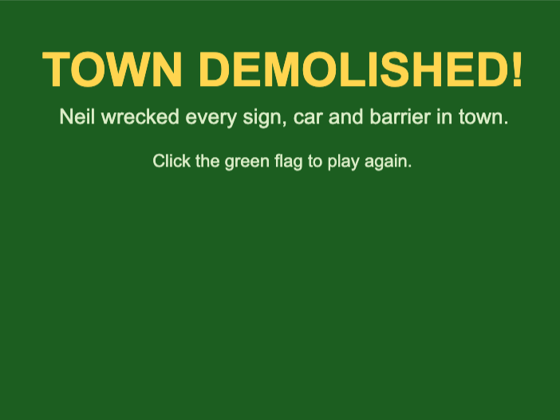

## Make a Win screen

The player wins by smashing everything in town.

Click on the `Stage`, then the `Backdrops`{:class="block3looks"} tab.

Hover over **Choose a Backdrop** and click **Paint** to make a new, blank backdrop.

Call it `Win`, then give it a background and some celebratory text — write whatever you like.

You won't see your `Win` backdrop in the game yet — you'll make it appear in the next step.
