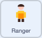

## Add the Ranger

It's time to add a Ranger to chase Neil around the town.



## Step 1

Click on the `Ranger`{:class="block3looks"} sprite.

Add a `when green flag clicked`{:class="block3events"} block, a `go to x: () y: ()`{:class="block3motion"} block to place the Ranger in the corner, and a `show`{:class="block3looks"} block.

```blocks3
when green flag clicked
go to x: (-200) y: (140)
show
```

## Step 2

The Ranger should only chase while the game is being played.

Add a `forever`{:class="block3control"} loop with an `if then`{:class="block3control"} block that checks `game over`{:class="block3variables"} is `0`.

You'll fill it in next.

```blocks3
when green flag clicked
forever
if <(game over) = (0)> then
end
end
```

The Ranger appears in the corner, but it won't move yet — you'll add its chase code over the next two steps.
