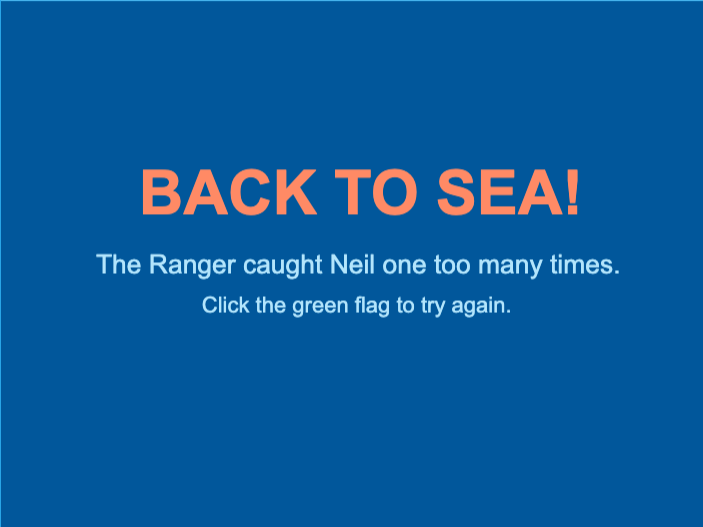

## Make a game over screen

The game should end when Neil runs out of lives.

Click on the `Stage`, then the `Backdrops`{:class="block3looks"} tab.

Hover over **Choose a Backdrop** and click **Paint** to make a new, blank backdrop.

Call it `game over`, and design it however you like.

You won't see your `game over` backdrop in the game yet — you'll make it appear in the next step.
