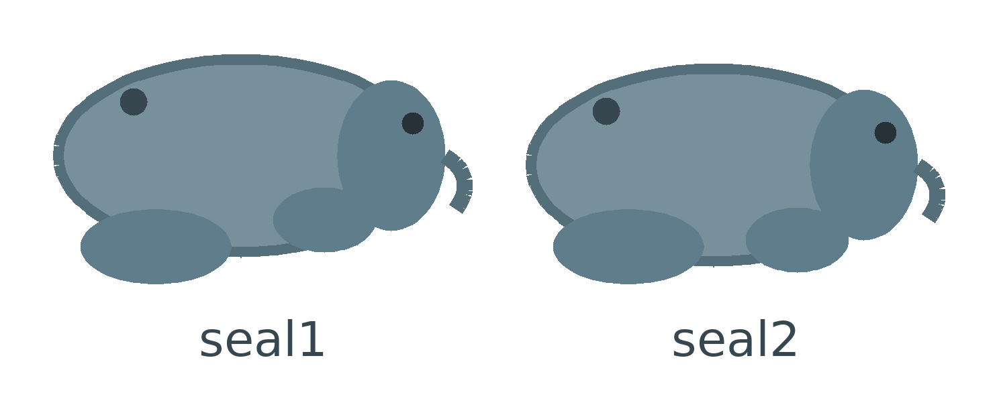

## Make Neil waddle

Right now Neil slides around without moving.

Give him a second costume so he looks like he's walking.


## Step 1

Click the `Costumes`{:class="block3looks"} tab.

Neil has one costume, called `seal1`.

Right-click `seal1` and choose **duplicate** to make `seal2`.

In the paint editor, move each of Neil's legs a little, so `seal2` is in a different pose to `seal1`.



## Step 2

Go back to the `Code`{:class="block3control"} tab.

Add a `next costume`{:class="block3looks"} block inside each of your four arrow-key `if then`{:class="block3control"} blocks, so Neil changes costume whenever he moves.

```blocks3
if <key (up arrow v) pressed?> then
change y by (5)
+next costume
end
```

## Now run your code

Click the green flag and move Neil around.

His two costumes swap back and forth, so he looks like he's waddling.
