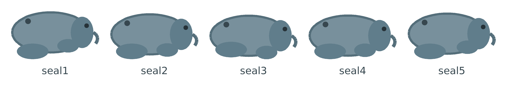
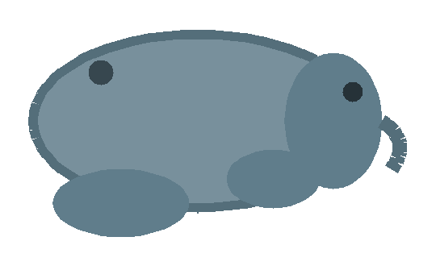

## Add more costumes

Two costumes give Neil a simple wobble. Adding a few more makes his movement much smoother.

Duplicate one of your costumes to make `seal3`, then move the legs again for a new pose. Keep going until Neil has five costumes, each with the legs in a slightly different position.

## Now run your code

Click the green flag and move Neil around. The `next costume`{:class="block3looks"} block cycles through all five poses, giving Neil a smooth waddle.

--- no-print ---

--- /no-print ---
