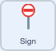

## Make the signs disappear

Give the signs a script so they vanish when Neil reaches them.



Start a new script with a `when I start as a clone`{:class="block3control"} block.

Add a `forever`{:class="block3control"} loop, and inside it an `if then`{:class="block3control"} block that checks whether the clone is `touching Neil`{:class="block3sensing"}.

If it is, `delete this clone`{:class="block3control"}.

```blocks3
when I start as a clone
forever
if <touching (Neil v)?> then
delete this clone
end
end
```

## Now run your code

Click the green flag and move Neil into a sign.

It disappears.
